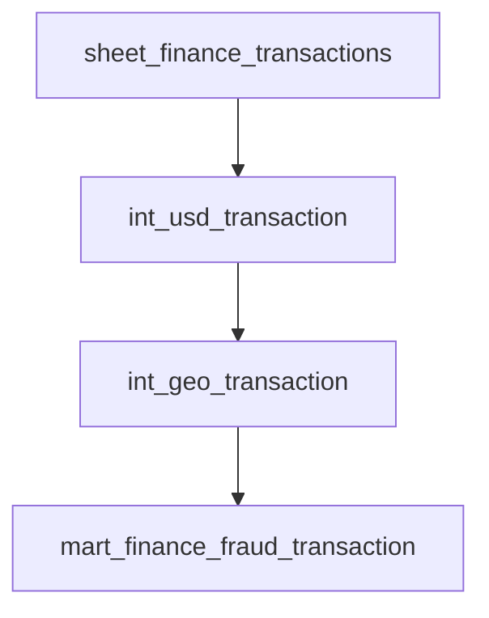

# Finance Transaction Data Pipeline

This project includes finance transaction data handling end-to-end project, powered by **Apache Airflow**, **PostgreSQL**, and **dbt**, all packaged with **Docker Compose**.

## Features
- **Modern orchestration** with Apache Airflow `3.0.3`
- **Data transformations** using `dbt`
- **PostgreSQL** for both orchestration metadata and pipeline storage
- **Docker Compose** setup with:
  - Airflow (Scheduler, API Server, Worker)
  - Redis (for Celery broker)
  - Two PostgreSQL databases (Airflow metadata + pipeline database, for separating the workflow).
- Sample `.env` configuration for credentials and connections.
- Modular, production-ready structure.

## Project Structure

```
finance-transaction/
│
├── dags/                       # Airflow DAG definitions
├── config/scripts/             # Setup & helper scripts
│ ├── datamart_finance_day/     # Store dbt project for Data Mart view
│ ├── ingest_finance_day/       # Store raw ingestion & dbt staging (Raw -> Ingest)
│ └── present_finance_day/      # Store dbt Intermediate Data source project
├── data/data_source/           # Raw data sources
├── dbt_project/                
│ └── staging/                  # Safe profiles.yaml data for dbt project
├── others/                     # Miscellaneous utilities
│
├── .env                        # Environment variables (sample provided)
├── docker-compose.yaml         # Service definitions for local setup
├── requirements.txt            # Python dependencies
└── README.md                   # Project documentation
```

## Prerequisites
- **Docker** >= 20.x
- **Docker Compose** >= 1.29
- **Python** 3.10+ (if running dbt locally without Docker)
- **dbt-postgres** plugin (for running dbt with Postgres)
- **PostgreSQL**

### Setup Environment

#### Clone the Repository
```bash
git clone https://github.com/rizuchaa/finance-transaction.git
cd finance-transaction
```

#### Create credentials in .env
```bash
# POSTGRESQL CONFIGURATION
POSTGRES_USER=airflow
POSTGRES_PASSWORD=airflow
POSTGRES_DB=airflow
POSTGRES_PORT=5433

# OTHER POSTGRESQL CONFIGURATION
OTHER_POSTGRES_USER=postgres
OTHER_POSTGRES_PASSWORD=new_postgres
OTHER_POSTGRES_DB=postgres
OTHER_POSTGRES_PORT=5432

# DBT Configuration
DBT_PROJECT_NAME=finance_transaction
DBT_PROFILE_NAME=finance_transaction_profile
DBT_TARGET=dev

# PIP Requirements
_PIP_ADDITIONAL_REQUIREMENTS=pandas pyarrow psycopg2-binary dbt-postgres python-dotenv
```

#### Launch Docker
```bash
docker-compose up -d
```

This launches:
- Postgres (Airflow metadata)
- Postgres (pipeline database)
- Redis
- Airflow Scheduler, Webserver, Worker

> Access Airflow UI at: http://localhost:8080

# Set-up & Running dbt

## 1. Install dbt
The dbt is already installed when you launch Docker (see PIP Requirements)

## 2. Configure dbt Profile
dbt uses a profiles.yml file (usually in ~/dbt_project/staging/profiles.yml):
```yaml
finance_transaction:
  target: dev
  outputs:
    dev:
      type: postgres
      host: <pipeline-postgre-container>
      user: postgres
      password: <password>
      port: 5432
      dbname: staging_finance
      schema: staging
    
    prod:
      type: postgres
      host: <pipeline-postgre-container>
      user: postgres
      password: <password>
      port: 5432
      dbname: staging_finance # This project aims all data recorded in the same db.
      schema: public
```
If running dbt inside Docker, host should be postgres-pipeline (the container name).

## 3. Run dbt (inside Docker)
```bash
docker compose exec -it finance-transaction-airflow-worker-1 bash
cd config/scripts/{desired project}

# Install dependencies (if any)
dbt deps

# Run all models
dbt run

# Test models
dbt test
```

# Workflow
- Airflow orchestrates data ingestion from data/data_source/ and loads into the pipeline PostgreSQL.
- dbt transforms raw data into structured, analytics-ready tables.
- Airflow DAGs trigger dbt runs after ingestion completes.
- the rest of dbt process from ingestion -> staging -> intermediate -> mart orchestrated by Airflow.

> [!TIP] 
[The DAG Structure explained here](https://github.com/rizuchaa/finance-transaction/tree/main/dags#readme)

From the DAG structure, the data flow described as:
| Stage	|DAG	|Data Source	|Output Table
|:--|:--|:--|:--|
|Ingestion |	ingest_finance_day	| CSV	| staging.* tables |
|Presentation|	present_finance_day|	Standardized tables	| Curated USD & GEO transactions|
|Datamart|	datamart_finance_day|	Presentation tables	| Fraud analysis mart|

# Data Structure
The data structure follows the ELT process, from
- ingestion (raw_data) -> 
- staging (cleanse and impute data) -> 
- intermediate (join & create reusable tables) -> 
- mart (reporting view).


> [!TIP] 
[Detailed data structure explained here](https://github.com/rizuchaa/finance-transaction/tree/main/config/scripts#readme)

In the process, I found converting the currency to USD was challenging, since the data was not implied to the real currencies, such as:

| currency	|amount	|
|:--|:--|
|USD |	503.15	| 
|IDR|	155.50|
|JPY|	203.50|

since the conversions seems 'off' (Rp155.5 = $0.0095), The data will be interpolated as below:

- IDR: amount * 10000 (before conversion)
- JPY: amount * 100 (before conversion)

# Case: Fraud Analysis

**Objective:**  

Identify potential fraudulent transactions by combining transaction data, customer details, and geolocation from the customers.

---
### 1. Data Sources
Fraud detection uses a multi-layer data transformation:

1. **`staging_std.sheet_finance_transactions`**  
   Clean and validate raw transaction records.
2. **`public_int.int_usd_transaction`**  
   Convert all amounts to USD and prepare for aggregation.
3. **`public_int.int_geo_transaction`**  
   Join transaction data with customer geolocation and account type.
4. **`public.mart_finance_fraud_transaction`**  
   Apply fraud detection rules and aggregate results.
---
### 2. Fraud Detection Logic
The fraud logic (implemented in `mart_finance_fraud_transaction`) can be set to:
- Flag transactions above a **threshold amount** in USD.
- Detect **multiple transactions in a short time window**.
- Identify **transactions across distant geographies** within an unrealistic time span.
- Count **distinct merchants** involved with a single customer in a short period.

These rules are applied in SQL within the dbt model and can be tuned per business needs.

---

### 3. Output Metrics
The **fraud mart** produces the following KPIs for each `(customer_name, city, province)` group:

| Column | Description |
|:-- | :-- |
| `fraud_transaction_count` | Number of transactions flagged as fraud. |
| `fraud_transaction_usd_total` | Total USD amount of fraud transactions. |
| `fraud_distinct_merchants` | Number of unique merchants in fraud transactions. |
| `first_transaction_date` | Earliest fraud transaction date in the group. |
| `last_transaction_date` | Latest fraud transaction date in the group. |

---

### 4. Example Use Cases
- **Real-Time Alerts:**  
  Combine the `mart_finance_fraud_transaction` table with a monitoring dashboards / internal tool to trigger alerts when thresholds are exceeded.
- **Investigations:**  
  Enable fraud analysts to query historical suspicious activity by geography, customer, and merchant patterns.
- **Regulatory Reporting:**  
  Prepare compliance reports for suspicious activity in financial transactions.

---

### 5. Sample Result: mart_finance_fraud_transaction
[!ATTENTION]
The transaction amount stores in hundreds ('00)

[Result]()

### 6. DAG Dependency for Fraud Analysis



# Future Update
All of the environments and codes were not fully optimized. In the near future, this repo will be updated with newest approach:
- Simplify code (by utilizing functions & modules) to reduce redundant code
- Scrapping daily currencies to optimize currency conversion.


