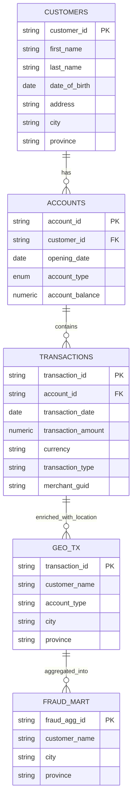

# Data Structure

This document describes the **data structure** for the `finance-transaction` pipeline,  
covering **raw ingestion**, **standardization**, **intermediate processing**, **presentation**, and **datamart** layers.

To generating the table / view, refer to this table for standardize the sql name:

| Prefix  | Meaning                                  |
| :-- | :-- |
| `raw_`  | Raw CSV data.                     |
| `std_`  | Cleaned & standardized data.             |
| `int_`  | Intermediate analytical transformations. |
| `mart_` | Final analytical datamarts.              |

---

## 1. Raw Layer (Ingest)
**Purpose**: Store unmodified data from CSV exports to PostreSQL table.
| Table| Source File | Columns |
| :-- | :-- | :-- |
| `staging.raw_sheet_finance_accounts` | `account.csv`  | `account_id`, `customer_id`, `opening_date`, `account_type`, `balance`                                      |
| `staging.raw_sheet_finance_customers`    | `customers.csv`    | `customer_id`, `first_name`, `last_name`, `date_of_birth`, `address`, `city`, `province`                    |
| `staging.raw_sheet_finance_transactions` | `transactions.csv` | `transaction_id`, `account_id`, `transaction_date`, `amount`, `currency`, `transaction_type`, `merchant_id` |

## 2. Standardized Layer (Staging)
**Purpose**: Clean, impute, and standardize raw data using dbt.

`staging_std.sheet_finance_accounts`
| Column            | Description                                        | Tests                |
| :-- | :-- | :-- |
| `account_id`      | Account unique ID.                                 | `not_null`, `unique` |
| `customer_id`     | Customer ID associated with the account.           | `not_null`           |
| `account_type`    | Account type. Enum: `loan`, `savings`, `checking`. | `not_null`           |
| `account_balance` | Current account balance.                           | —                    |
| `opening_date`    | Date the account was opened.                       | —                    |

---

`staging_std.sheet_finance_customers`
| Column          | Description                   | Tests                |
| :-- | :-- | :-- |
| `customer_id`   | Customer unique ID.           | `not_null`, `unique` |
| `first_name`    | Customer's first name.        | —                    |
| `last_name`     | Customer's last name.         | —                    |
| `date_of_birth` | Customer's date of birth.     | —                    |
| `address`       | Customer's address.           | —                    |
| `city`          | Customer's city location.     | —                    |
| `province`      | Customer's province location. | —                    |

---

`staging_std.sheet_finance_transactions`
| Column               | Description                                            | Tests                |
| :-- | :-- | :-- |
| `transaction_id`     | Transaction unique ID.                                 | `not_null`, `unique` |
| `account_id`         | Account ID for the transaction.                        | `not_null`           |
| `transaction_type`   | Enum: `purchase`, `transfer`, `deposit`, `withdrawal`. | `not_null`           |
| `transaction_amount` | Transaction amount.                                    | —                    |
| `currency`           | Currency type.                                         | —                    |
| `merchant_guid`      | Merchant GUID.                                         | —                    |
| `transaction_date`   | Transaction date.                                      | —                    |
---

## 3. Intermediate Processing 
**Purpose**: Transform standardized data for cross-entity analytics, before reporting.

`public_int.int_usd_transaction`
| Column                   | Description                    | Tests                                                             |
| :-- | :-- | :-- |
| `transaction_id`         | Unique transaction ID.         | `not_null`, `unique`                                              |
| `account_id`             | Unique account ID.             | `not_null`, `unique`, foreign key to `std_sheet_finance_accounts` |
| `currency_type`          | Original transaction currency. | —                                                                 |
| `transaction_amount`     | Amount in original currency.   | —                                                                 |
| `transaction_usd_amount` | Amount converted to USD.       | —                                                                 |
| `merchant_guid`          | Merchant GUID.                 | —                                                                 |
| `transaction_date`       | Transaction date.              | —                                                                 |

---

`public_int.int_geo_transaction`
| Column                   | Description                          | Tests                |
| :-- | :-- | :-- |
| `transaction_id`         | Unique transaction ID.               | `not_null`, `unique` |
| `customer_name`          | Customer’s full name.                | —                    |
| `account_type`           | Enum: `LOAN`, `CHECKING`, `SAVINGS`. | —                    |
| `currency_type`          | Original transaction currency.       | —                    |
| `transaction_amount`     | Amount in original currency.         | —                    |
| `transaction_usd_amount` | Amount in USD.                       | —                    |
| `city`                   | Customer city.                       | —                    |
| `province`               | Customer province.                   | —                    |
| `merchant_guid`          | Merchant GUID.                       | —                    |
| `transaction_date`       | Transaction date.                    | —                    |

---

## 4. Data Mart
**Purpose**: Aggregated datasets for specific analytical use cases.

`public.mart_finance_fraud_transaction`
| Column                        | Description                                       | Tests                |
| :-- | :-- | :-- |
| `fraud_agg_id`                | Surrogate key for fraud aggregation.              | `not_null`, `unique` |
| `customer_name`               | Name of customer.                                 | `not_null`           |
| `city`                        | Customer city.                                    | `not_null`           |
| `province`                    | Customer province.                                | `not_null`           |
| `fraud_transaction_count`     | Number of flagged fraud transactions.             | `not_null`           |
| `fraud_transaction_usd_total` | Total USD of fraud transactions.                  | `not_null`           |
| `fraud_distinct_merchants`    | Number of unique merchants in fraud transactions. | `not_null`           |
| `first_transaction_date`      | Earliest fraud transaction date.                  | `not_null`           |
| `last_transaction_date`       | Latest fraud transaction date.                    | `not_null`           |

---

# ERD

