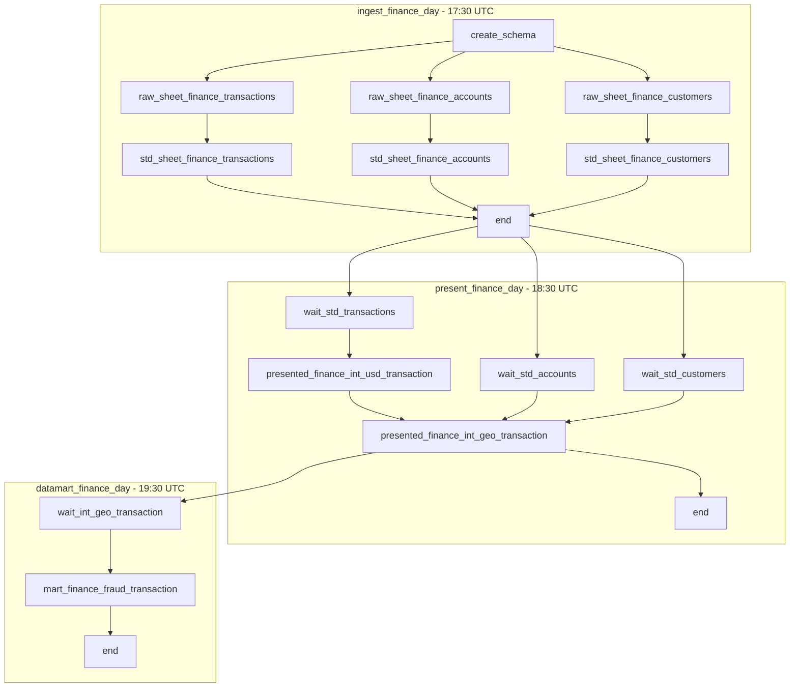

# DAG Flow: Explained

The pipeline is composed of **three sequential DAGs**:

1. **`ingest_finance_day`** — Ingests raw data into a staging schema and runs standardization transformations.
2. **`present_finance_day`** — Waits for ingestion, then produces curated business-facing datasets.
3. **`datamart_finance_day`** — Waits for presentation datasets, then builds analytical datamarts.

The DAGs run daily in a chain:
```
17:30 UTC → ingest_finance_day
18:30 UTC → present_finance_day
19:30 UTC → datamart_finance_day
```

## Architecture Diagram


## DAG Breakdown

### 1. ingest_finance_day
- **Schedule**: `30 17 * * *` (17:30 UTC)
- **Purpose**: Ingest raw CSV data into Postgres, then standardize with dbt.
- **Tasks**:
    - `create_schema` (Ensures `staging` schema exists in Postgres).
    - RAW ingestion:
        - `raw_sheet_finance_transactions`
        - `raw_sheet_finance_accounts`
        - `raw_sheet_finance_customers`
    - STD transformation:
        - `std_sheet_finance_transactions`
        - `std_sheet_finance_accounts`
        - `std_sheet_finance_customers`
    - `end` (Marks completion).

### 2. present_finance_day
- **Schedule**: `30 18 * * *` (18:30 UTC)
- **Purpose**: Waits for standardized datasets, then builds intermediate datasets.
- **Tasks**:
    - Wait for ingestion DAG (ExternalTaskSensor):
        - `wait_std_transactions_int_usd_transaction`
        - `wait_std_accounts_int_geo_transaction`
        - `wait_std_customers_int_geo_transaction`
    - Transformations:
        - `presented_finance_int_usd_transaction`
        - `presented_finance_int_geo_transaction`
    - `end` (Marks completion).

### 3. datamart_finance_day
- **Schedule**: `30 19 * * *` (19:30 UTC)
- **Purpose**: Waits for presentation datasets, then builds the fraud transaction datamart.
- **Tasks**:
    - Wait for GEO transaction dataset from `present_finance_day`.
    - Transformation:
        - `mart_finance_fraud_transaction`
    - `end` (Marks completion).